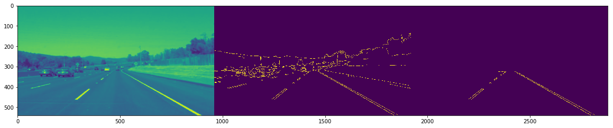
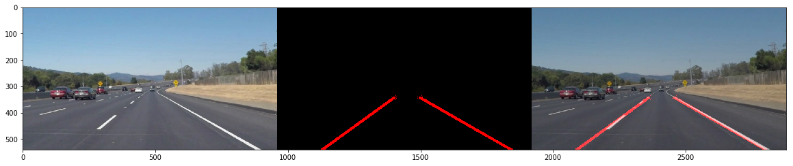

# **Finding Lane Lines on the Road**
---

**Finding Lane Lines on the Road**

The goals / steps of this project are the following:
* Make a pipeline that finds lane lines on the road
* Reflect on your work in a written report

[//]: # (Image References)

---

### Reflection

### 1. Describe your pipeline. As part of the description, explain how you modified the draw_lines() function.

My pipeline consists of 7 parts:

1. First I transform the image using a grayscale function.
2. Next the image goes through a gaussian process to smooth out / simplify the image.
3. To begin looking for lane lines, next we do Canny edge detection, essentially looking for strong contrasts in color or 'edges'
4. Next I narrow the image to eliminate irrelevant areas such as the sky from our model.
5. To search for the strongest / longest lines, I then use a Hough Transform to
narrow down the search for the lane lines.  Here we primarily focus on the longer lines, which we can use later to help weight our regression model.
6. The lines returned from the Hough Transform are then used as the basis for
extrapolating where the lane lines are.  I used a regression model, splitting
the lines returned by the Hough Transform by slope.  The trained models were then used to estimate the 'best fit' line.
7. I then use the weighted_img function to draw our predicted lane lines on the original image.

Below is an image from steps 1-5

And finally the original image, Hough Transform, and weighted image:

### 2. Identify potential shortcomings with your current pipeline

One issue I noticed was that the lines, although they followed the lane lines quite closely, was that they were rather shaky, almost like vibrating on the line.  

Another shortcoming was the color detection in my model.  It was able to handle the yellow and white lines well, however the challenge project caused utter chaos!

### 3. Suggest possible improvements to your pipeline

Much of my code could have been cleaned up to be made more readable / maintainable.

Filtering out colors other than yellow and white could allow for better line detection, and shrinking the polygon (or 'area of interest') would also help with colors as well as with avoiding detecting the cars' hood.
